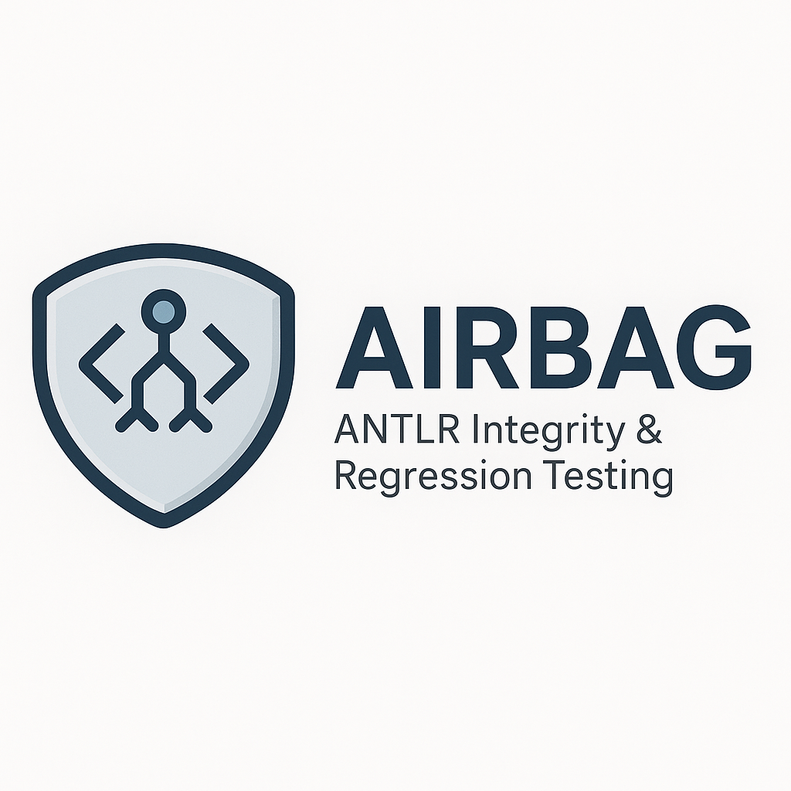

# Airbag

Airbag is a Java library that helps in testing ANTLR grammars. It provides utilities to compare lists of tokens and generate human-readable diffs when they don't match. This is particularly useful for writing unit tests for lexers and parsers created with ANTLR.